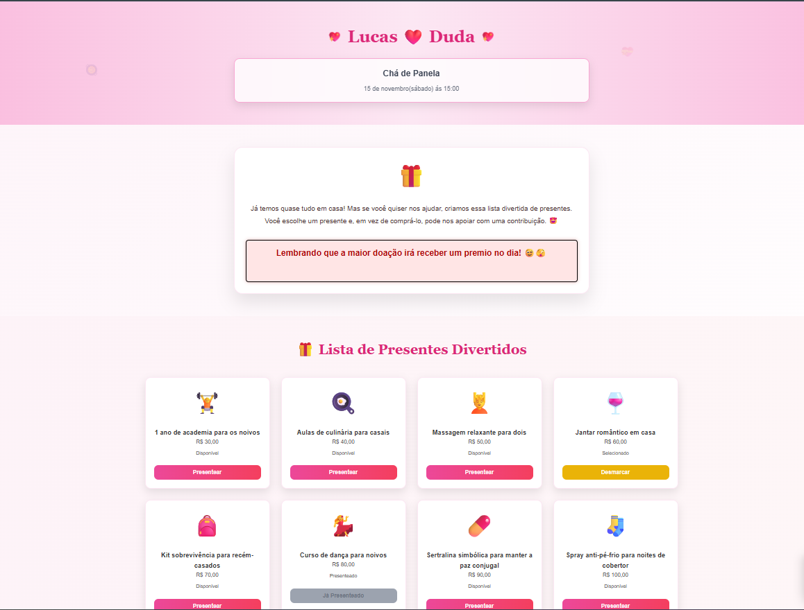

# Site Chá de Panela - Lucas ❤️ Duda

Um site moderno, divertido e romântico para o chá de panela do casal Lucas e Duda.

## 📁 Arquivos do Projeto

- `index.html` - Estrutura HTML principal do site
- `style.css` - Estilos CSS com design responsivo
- `script.js` - Funcionalidades JavaScript interativas
- `README.md` - Este arquivo de documentação

## 🚀 Como Usar

1. **Abrir o site**: Abra o arquivo `index.html` em qualquer navegador web
2. **Personalizar**: Edite os arquivos conforme necessário
3. **Hospedar**: Faça upload dos arquivos para qualquer serviço de hospedagem web

## ✨ Funcionalidades

### 🎀 Cabeçalho
- Nomes dos noivos em destaque: "Lucas ❤️ Duda"
- Data do chá de panela (configurável)
- Fundo com elementos fofos animados (corações, panelinhas, utensílios)

### 💡 Seção Introdutória
- Texto explicativo sobre a lista de presentes
- Design elegante com card centralizado

### 🎁 Lista de Presentes Fictícios
- Cards responsivos (3 por linha no desktop, 1 no mobile)
- Cada card contém:
  - Emoji ilustrativo
  - Nome do presente fictício
  - Valor sugerido
  - Status do presente (Disponível/Selecionado/Presenteado)
  - Botão "Presentear" interativo

### 📲 Seção PIX
- Chave PIX em destaque: `47745213886`
- Botão "Copiar chave PIX" funcional
- Placeholder para QR Code
- Scroll automático quando um presente é selecionado

### ✨ Rodapé
- Mensagem de agradecimento
- Assinatura do casal

## 🎨 Design

- **Cores**: Rosa claro, branco e dourado
- **Fontes**: Arial (principal) e Georgia (títulos)
- **Estilo**: Minimalista, romântico e divertido
- **Animações**: Efeitos hover, bounce e pulse
- **Responsivo**: Adaptado para desktop, tablet e mobile

## 🔧 Como Adicionar Novos Presentes

### Método 1: Editando o JavaScript
Abra o arquivo `script.js` e adicione um novo objeto no array `presents`:

```javascript
{
    id: 7, // Próximo ID disponível
    name: "Nome do novo presente",
    value: "R$ XX,XX",
    status: "available", // available, selected, ou given
    icon: "🎁" // Emoji do presente
}
```

### Método 2: Usando JavaScript no Console
Abra o site no navegador, pressione F12 e digite no console:

```javascript
addNewPresent("Nome do presente", "R$ XX,XX", "🎁");
```

## 📱 Responsividade

O site é totalmente responsivo e se adapta a diferentes tamanhos de tela:

- **Desktop**: Layout em 3 colunas para presentes
- **Tablet**: Layout em 2 colunas
- **Mobile**: Layout em 1 coluna

## 🎯 Status dos Presentes

- **Disponível** (verde): Presente pode ser selecionado
- **Selecionado** (amarelo): Presente foi escolhido mas ainda não confirmado
- **Presenteado** (rosa): Presente já foi dado/confirmado

## 🔄 Funcionalidades JavaScript

### Principais Funções:
- `handlePresentClick(id)` - Seleciona um presente
- `copyPixKey()` - Copia a chave PIX
- `addNewPresent(name, value, icon)` - Adiciona novo presente
- `updatePresentStatus(id, status)` - Atualiza status do presente
- `removePresent(id)` - Remove um presente

## 🌟 Recursos Especiais

- **Animações CSS**: Elementos com bounce, pulse e hover effects
- **Scroll suave**: Navegação automática para seção PIX
- **Clipboard API**: Cópia automática da chave PIX
- **Intersection Observer**: Animações quando elementos entram na tela
- **Fallback para cópia**: Funciona mesmo em navegadores mais antigos

## 🎨 Personalização

### Alterar Cores:
Edite as variáveis CSS no arquivo `style.css`:
- Rosa principal: `#db2777`
- Rosa claro: `#f9a8d4`
- Fundo: `#fdf2f8`

### Alterar Chave PIX:
No arquivo `script.js`, modifique a variável:
```javascript
const pixKey = "SUA_NOVA_CHAVE_PIX";
```

### Alterar Textos:
Edite diretamente no arquivo `index.html` ou nas variáveis do `script.js`.

## 📞 Suporte

Para dúvidas ou personalizações adicionais, consulte os comentários nos arquivos de código.

---

**Feito com 💕 para Lucas & Duda**

